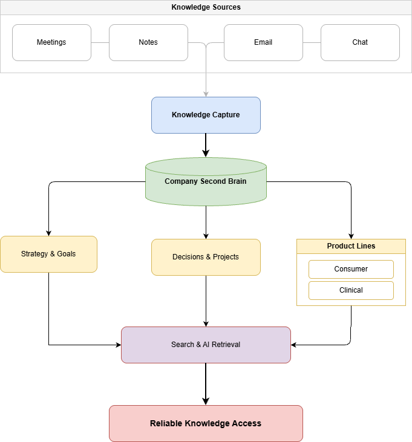

#Company Second Brain Strategy

## Overview

The company currently relies on fragmented knowledge spread across meetings, notes, emails, chat conversations, and individual team members. As the organization grows, this creates unnecessary dependency on the founder, makes important decisions difficult to track, and slows down information retrieval.

This proposal outlines a lightweight Company Second Brain designed to become the organization's single trusted source of truth. Instead of acting as a document repository, it serves as the company's operational memory by consistently capturing knowledge, organizing information with a clear structure, enabling fast retrieval, and keeping content accurate through simple ownership and maintenance practices.

The strategy prioritizes simplicity, low-friction adoption, and long-term maintainability, making company knowledge easy to capture today and easy to retrieve months later.

## Scope

The proposed Second Brain is designed to manage:  

- Strategic knowledge (goals, priorities, and company direction)  
- Decisions and meeting outcomes  
- Active projects and operational documentation  
- Consumer product knowledge  
- Clinical product knowledge


## Design Principles

The proposed Second Brain is designed around five guiding principles:

- **Single Source of Truth** – Company knowledge should live in one trusted system to eliminate duplicated information and reduce dependency on individual team members.
- **Low-Friction Capture** – Capturing information should require minimal effort, making documentation a natural part of daily work instead of an additional task.
- **Structured Knowledge** – Information should follow a consistent taxonomy that clearly separates Consumer and Clinical product knowledge while remaining easy to navigate.
- **Fast Retrieval** – Team members should be able to locate relevant decisions, documentation, and meeting outcomes within seconds through clear organization and intelligent search capabilities.
- **Sustainable Ownership** – Every important piece of knowledge should have an owner and lightweight maintenance process to prevent the system from becoming outdated over time.


## Capture

Knowledge should be captured as part of existing workflows, making documentation a by-product of daily work rather than an additional responsibility.

The system collects information from four primary sources:

- **Meeting outcomes** – Key decisions, action items, and important context captured immediately after each meeting.
- **Notes** – Relevant knowledge documented during daily work and promoted to shared documentation when valuable to the team.
- **Email** – Important announcements and decisions preserved beyond individual inboxes.
- **Team chat** – Conversations containing reusable knowledge, processes, or decisions converted into permanent documentation.

Rather than storing every conversation, the focus is on preserving information that remains valuable over time, keeping the knowledge base concise, searchable, and easy to maintain.

## Organize

Information should be organized using a simple, consistent taxonomy that reflects how the company operates rather than where the information originated.

The knowledge base is divided into shared company knowledge and product-specific knowledge, ensuring that strategic information remains centralized while Consumer and Clinical knowledge stay clearly separated.

```text

Company

├── Strategy & Goals

├── Decisions

├── Projects

├── Operations

├── Consumer Product

└── Clinical Product

```

Rather than storing complete meeting records, meetings should produce structured outputs such as decisions, action items, and project updates. Combined with consistent naming conventions, lightweight tagging, and standardized templates, this approach keeps information easy to navigate without introducing unnecessary complexity.

## Retrieve

The system should enable team members to find reliable answers in seconds, regardless of when the information was originally captured. A consistent structure, standardized templates, and searchable metadata make navigation predictable and efficient.

AI enhances retrieval by summarizing long documents, surfacing related knowledge, and answering natural language questions while always linking back to the original source. This allows employees to quickly understand the context behind a decision without replacing the underlying documentation.

The goal is not simply to search documents, but to make organizational knowledge accessible, trustworthy, and actionable months after it was created.

##Maintain

A Second Brain only creates value if its information remains current and trustworthy. Rather than relying on occasional documentation initiatives, maintenance should become part of the team's regular workflow.

Each knowledge area should have a clearly defined owner responsible for keeping its content accurate and up to date. Obsolete information should be archived instead of deleted, preserving historical context while keeping active documentation concise and relevant.

To prevent knowledge decay, the team should adopt lightweight recurring practices such as reviewing outdated content, archiving completed projects, updating key decisions, and removing duplicate information. This governance approach keeps the system reliable without introducing unnecessary operational overhead.

## 30-Day Rollout

The Second Brain should be introduced gradually to encourage adoption without disrupting existing workflows.

| Week | Focus |

|------|-------|

| **Week 1** | Establish the knowledge structure, define ownership, and create standardized templates. |

| **Week 2** | Begin capturing meeting outcomes, key decisions, and documentation for active projects. |

| **Week 3** | Validate adoption, gather team feedback, and refine the knowledge structure where necessary. |

| **Week 4** | Archive outdated content and establish recurring ownership and maintenance routines. |

This phased rollout allows the team to adopt the system naturally, making documentation part of everyday work rather than a separate initiative.

## Architecture Diagram

The diagram below summarizes the proposed knowledge flow...

