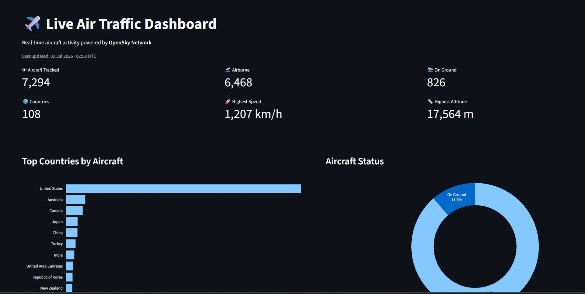

# ✈️ Live Air Traffic Dashboard



A real-time dashboard built with Streamlit that visualizes live aircraft data from the OpenSky Network API.
```

## Features

- Live aircraft data from OpenSky Network
- Automatic refresh every 60 seconds
- Dashboard KPIs
- Top countries by active aircraft
- Aircraft status distribution
- Search and filter aircraft
- Latest aircraft state table

---

## Tech Stack

- Python 3.12
- Streamlit
- Pandas
- Plotly
- Requests

---
## Project Structure

```text
03_Live_Dashboard/

├── app.py
├── README.md
├── requirements.txt
│
└── src/
    ├── api.py
    ├── dashboard.py
    └── metrics.py
```
## Installation

Clone the repository:

```bash

git clone <repository_url>

cd 03_Live_Dashboard

```

Install dependencies:

```bash

pip install -r requirements.txt

```

---

## Run the application

```bash
streamlit run app.py
```
```

The dashboard will be available at:
```
http://localhost:8501
```
---

## Dashboard Overview

The dashboard includes:

- Live KPI summary
- Top 10 countries by aircraft count
- Aircraft status distribution
- Searchable aircraft table
- Automatic refresh every 60 seconds

---

## Data Source

OpenSky Network REST API

https://opensky-network.org/ 

## Notes

- Aircraft data is updated every minute.
- If the OpenSky API is temporarily unavailable, the dashboard displays a notification and automatically retries on the next refresh.

---

## Author

David Rada
